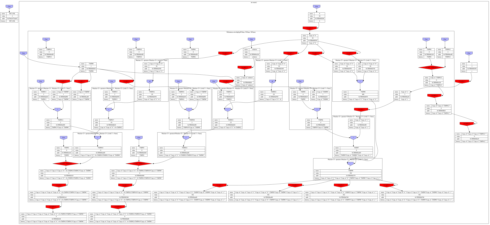
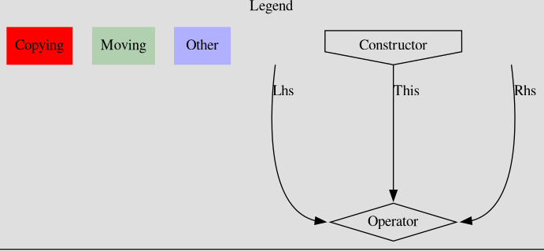
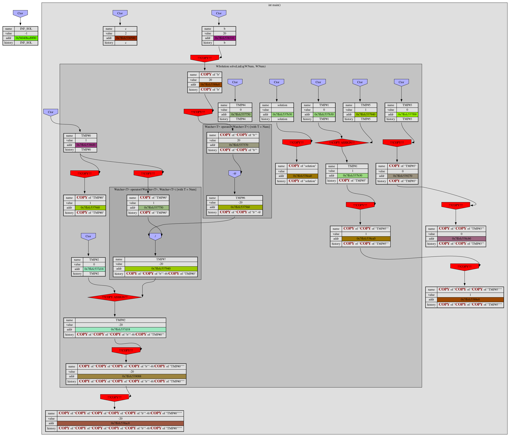
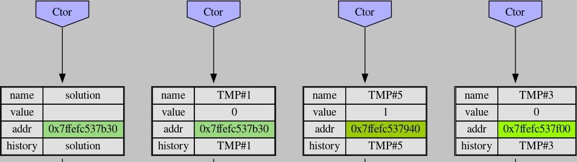
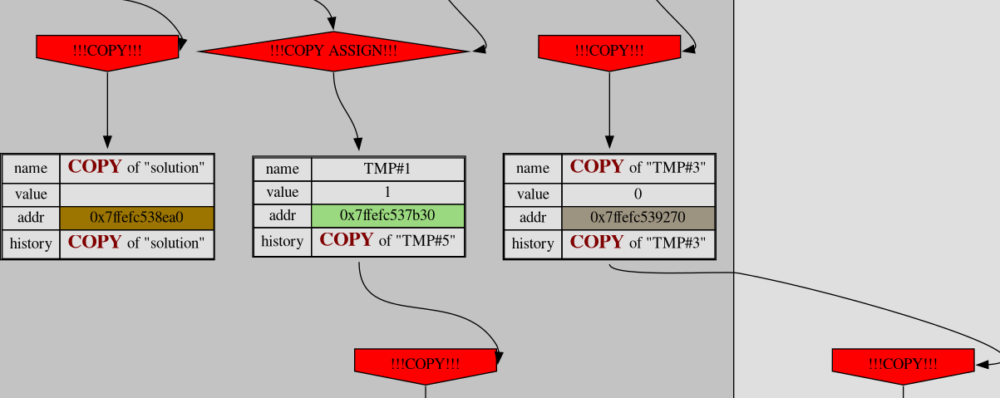
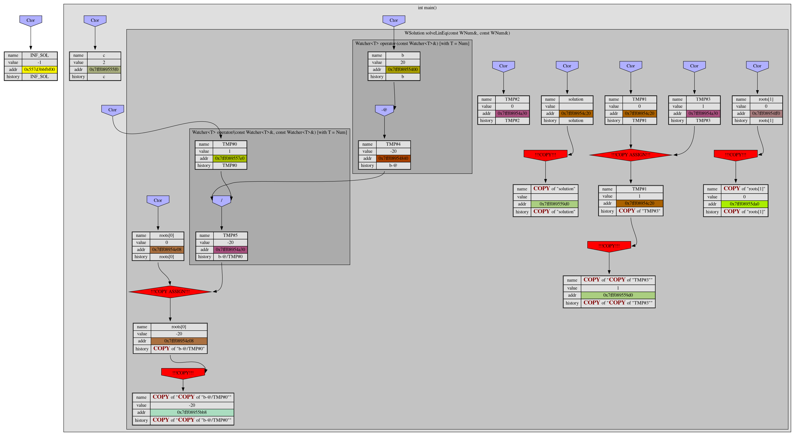
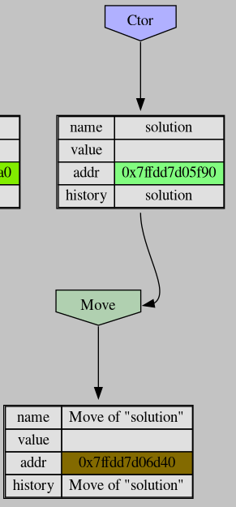
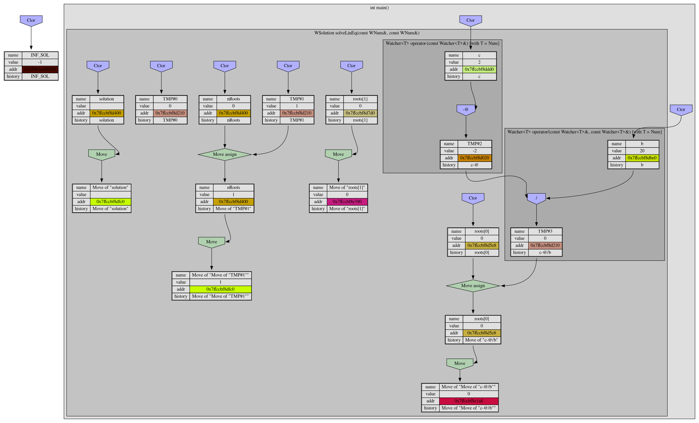
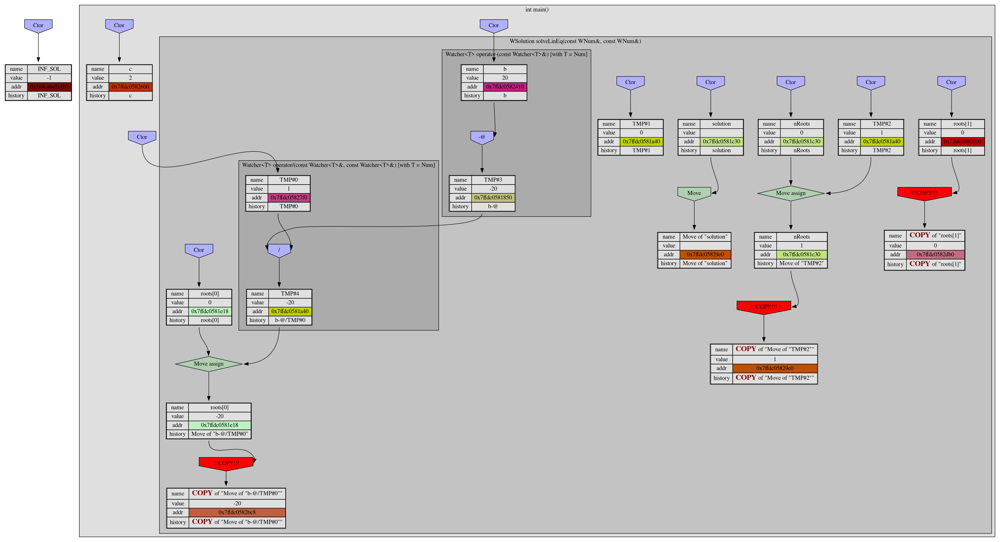
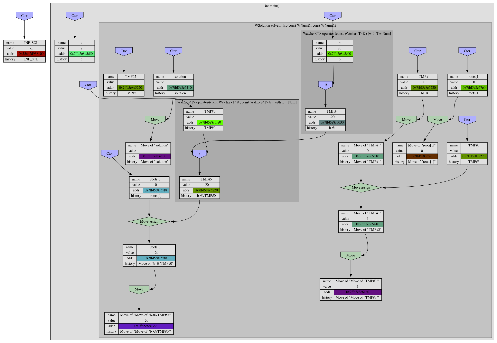

# Copy in Square.
## Or research on copy/move semantics in c++;

### Introduction.
###### No. It's just lirycs.
I'd been very glad when I knew about overloading. So I've decided to write long arithmetics in C++.
*Imagine that I wrote class Num performing long aritmetics.* 
As for test I decided to solve square equations. But programm worked too slow. I've been searching for ages to optimize, but that gave nothing.
One old man adviced me: "Too many copies". That was all he'd sad - he had to go rest. So I've decided to research this problem.

### Deep copy vs Shallow copy
My long arithmetics class posses some *external resource* - dynamically allocated memory: ```uint64_t* data``` When we copying number we **must** do a *deep copy* - alloc a new region and copy all data. Otherwise (in case of shallow copy - copy only field values) it leads to memory management and possesion problems: double frees, use after free. Or we will use same memoty more than once in same time.
### See the beast. 
To examine about copies I wrote simple [wrapper class](https://github.com/mishaglik/CopyTest/blob/ver1/src/Watcher.hpp).. And logged 
Lets create a template wrapper watcher class to check how many copying was done and amount of tmp objects.
```C++
using WNum = Watcher<Num>;

struct Solution
{
    WNum nRoots = "nRoots";
    WNum roots[2] = {{"roots[0]"}, {"roots[1]"}};
};
using WSolution = Watcher<Solution>;
```
So I've got next image:

Did you understand anything? Me - nothing beside I have ton of copies and tmp objects. And computer spent really lot of time to compute this.
So let's make task simplier and solve linear equation, color our scheme.
Let me explain what does everything in graph mean:

>Copies are red
>
>Others are blue
>
>Move is sweet
>
>~~But not as sweet as you…~~

Anything producing objects has shape "invhouse" (costructors). Diamond shape means operators such as assignment. Arrow to left means left side argument, to right - right side argument.
Also I've colored each address to unique color. So it will be possible to detect memoty usage.




Here we can see a lot of tmp objects:



and number of copies:


So we have **13 Copies and 8 temp objects**.
### Reduce copies.
First thing I'd been able to google was using const references.
So I'd performed this optimization where I could.
And I saw something terrible [here](https://github.com/mishaglik/CopyTest/blob/Linear/src/Watcher.hpp):
```C++
template<class T> 
Watcher<T> operator+(Watcher<T> lhs, Watcher<T> rhs);

Num operator+(Num a, Num b);

```
Let's do copies while doing copies. We're great! Copies in square.
[Fixing it](https://github.com/mishaglik/CopyTest/blob/Ref/src/Watcher.hpp)
Now all operators has next sematics:

```C++
Num operator+(const Num& a, const Num& b);

```
and picture has became much better:

So we have **6 Copies and 6 temp objects**. 
But I was unpleasant. So I've gone further.

### Move contstuctor.
I found next good artice by *link here*.
And implented move constructors ans assignment operators.
They has next semantics:
```C++
Num(Num&& oth) : x(oth.x) {}
```
Double ampersant is not reference to reference. It means reference to **rvalue**. Rvalue historically was name for expression on the right-hand side of an assignment expression. But in C++ it means "reference to temprorary object." We can just ~~steal~~ move data from one object to another.

Let's see [reuslt](https://github.com/mishaglik/CopyTest/blob/MoveCtors/src/Watcher.hpp):

**Copies: 3 Temp objects: 5**

It's better but not ok.
Where does this copies sit?
So ```solution``` was moved:


but all parts copied. *Brain explosion sounds*.
### Move
So let's see move constructor:
```C++
Solution(Solution&& sol)
        : nRoots(sol.nRoots), roots{sol.roots[0], sol.roots[1]} {}
```
And reading C++ standart we see that every named thing is lvalue.
So we have to cast it to rvalue.
But every time casting is annoying.
Let's write a function to do it (for explatations go to [article](https://habr.com/ru/post/322132/)):

So we need to do template funtion that casts lvalue to rvalue.
```C++
template<class T>
T&& move(T& t)
    return static_cast<T&&>(t));
}
```

this is not exellent because it can't take rvalue.
So let's override it for rvalue:
```C++
template<class T>
T&& move(T&& t)
    return static_cast<T&&>(t));
}
```
This is ok. But we can better. ```T&&``` in demonic hell named C++ is *universal* link. So it can accept as rvalue as lvaues. So we can implement move [like this](https://github.com/mishaglik/CopyTest/blob/move/src/MySTL.hpp):
<!-- TODO: More explanations -->
```C++
template<class T>
typename remove_reference<T>::type&& move(T&& t)
    return static_cast<typename remove_reference<T>::type&&>(t);
}
```
Now move looks in next way:
```C++
Solution(Solution&& sol)
       : nRoots(my::move(sol.nRoots)), roots{my::move(sol.roots[0]), my::move(sol.roots[1])} {}

Watcher(Watcher<T>&& other) : T(my::move(other))
{/*...*/}

```
and graph:


**0 copies, 5 tmp objects**

Totally win on copies! But problems don't leave us.
Let's change
```C++ 
    WSolution solution("solution");
```
to 
```C++ 
    WSolution solution(WNum(0), "solution");
```
and...

NOooooooooooooooooooooooooo!!!!!!!!!!!!!!!!
### Forwarding.
Fail in watcher realization:
```C++
template<class U>
    explicit Watcher(U u, const char* name = nullptr) :
        T(u)
    {
    /*...*/
    }
```
But what link to use. We can't just assume it to be lvalue or rvalue.
So we have to use ```U&&```

No effect!

Ou. It's design of C++ and u is lvalue(!) because it's named.
We need function that returns value - forward:
<!-- TODO: Some explanations. -->
```C++
 template<class T> //Lvalue case
    T&& forward(typename remove_reference<T>::type& a)
    {
        return static_cast<T&&>(a);
    }

    template<class T> //Rvalue case
    T&& forward(typename remove_reference<T>::type&& a)
    {
        return static_cast<T&&>(a);
    }
```
And out [final result](https://github.com/mishaglik/CopyTest/blob/master/src/MySTL.hpp) is:


## Typical mistakes.
Let's continue to implement wrapper functions. For example sqrt. It has two implementations: One for lvalue with copying, second for rvalue for no copy.

```C++
template<class U>
Watcher<U> wSqrt(Watcher<U>&& watcher)
{
    return sqrt(my::move(watcher));
}

```

Uuuups:

```
==41771==ERROR: AddressSanitizer: attempting double-free on 0x6020000003b0 in thread T0:
    #0 0x7fd70acc178a in operator delete(void*, unsigned long) /usr/src/debug/gcc/gcc/libsanitizer/asan/asan_new_delete.cpp:164
    #1 0x562603a86759 in Num::~Num() /home/user/DedInside/CopyTest/src/Num.hpp:13
    #2 0x562603a86759 in Watcher<Num>::~Watcher() /home/user/DedInside/CopyTest/src/Watcher.hpp:163
    #3 0x562603a86759 in Solution::~Solution() /home/user/DedInside/CopyTest/src/main.cpp:24
    #4 0x562603a86759 in Watcher<Solution>::~Watcher() /home/user/DedInside/CopyTest/src/Watcher.hpp:163
    #5 0x562603a86759 in solveLinEq(Watcher<Num> const&, Watcher<Num> const&) /home/user/DedInside/CopyTest/src/main.cpp:52
    #6 0x562603a88123 in main /home/user/DedInside/CopyTest/src/main.cpp:92
    #7 0x7fd709e3c78f  (/usr/lib/libc.so.6+0x2378f)
    #8 0x7fd709e3c849 in __libc_start_main (/usr/lib/libc.so.6+0x23849)
    #9 0x562603a7d564 in _start (/home/user/DedInside/CopyTest/build/GigaInt+0xc8564)
```
We accidentially casted lvalue to rvalue, when should be using copying.
So move is very bad here. We should use forward instead.

### Summary
We have at least 3 ways to reduce copying: 
+ Pass arguments by const reference
+ Write move constructors.
+ Use std::move, std::forward

And result is:

| Optimiztion     | Copies  | Temp object  |
|-----------------|---------|--------------|
|Defaut           | 13      |             8|
|Refs             |       6 |             6|
|Move contsructors| 3       | 5            |
|Move + forward   | 0       | 5            |

<!-- Only move, only fwd, 2 typical mistakes -->
<!-- Auto git on complie -->
