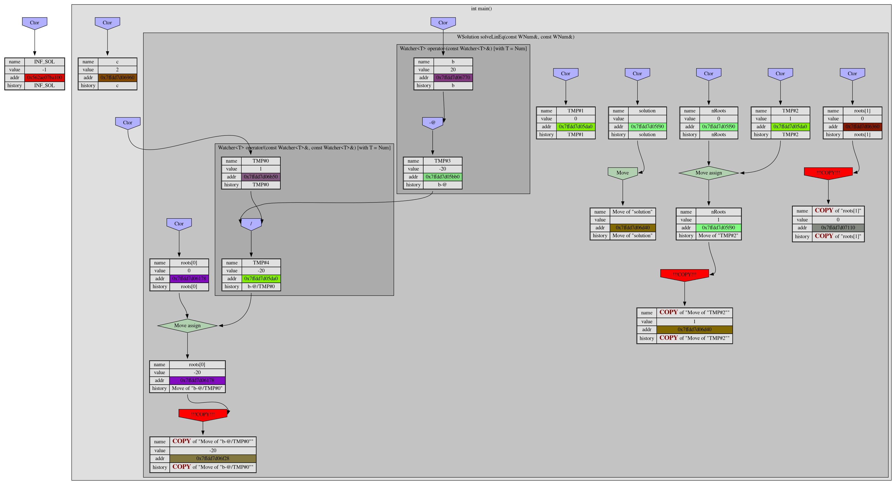

# Copy in Square.
## Or research on copy/move semantics in c++;

### Introduction.
###### No. It's just lirycs.
I'd been very glad when I knew about overloading. So I've decided to write long arithmetics in C++.
*Imagine that I wrote class Num performing long aritmetics.* 
As for test I decided to solve square equations. But programm worked too slow. I've been searching for ages to optimize, but that gave nothing.
One old man adviced me: "Too many copies". That was all he'd sad - he had to go rest. So I've decided to research this problem.

### See the beast. 
To examine about copies I wrote simple wrapper class. And logged 
Lets create a template wrapper watcher class to check how many copying was done and amount of tmp objects.
```C++
using WNum = Watcher<Num>;

struct Solution
{
    WNum nRoots = "nRoots";
    WNum roots[2] = {{"roots[0]"}, {"roots[1]"}};
};
using WSolution = Watcher<Solution>;
```
So I've got next image:

Did you understand anything? Me - nothing beside I have ton of copies and tmp objects. And computer spent really lot of time to compute this.
So let's make task simplier and solve linear:


Here we can see a lot of tmp objects:


and number of copies:


### Reduce copies.
First thing I'd been able to google was using const references.
So I'd performed this optimization where I could.
And I saw something terrible:
```C++
template<class T> 
Watcher<T> operator+(Watcher<T> lhs, Watcher<T> rhs);

Num operator+(Num a, Num b);

```
Let's do copies while doing copies. We're great! Copies in square.
Now all operators has next sematics:
```C++
Num operator+(const Num& a, const Num& b);

```
and pickture has became much better:

But I was unpleasant. So I've gone further.

### Movement contstuctor.
I found next good artice by *link here*.
And implented move constructors ans assignment operators.
They has next semantics:
```C++
Num(Num&& oth) : x(oth.x) {}
```
Double ampersant is not reference to reference. It means reference to **rvalue**. Rvalue so-called, historically, because rvalues could appear on the right-hand side of an assignment expression. But in C++ it means "reference to temprorary object." We can just ~~steal~~ move data from one object to another.

Let's see reuslt:

It's better but not ok.
Where does this copies sit?
So ```solution``` was moved:


but all parts copied. *Brain explosion sounds*.
### Move
So let's see move constructor:
```C++
Solution(Solution&& sol)
        : nRoots(sol.nRoots), roots{sol.roots[0], sol.roots[1]} {}
```
And reading C++ standart we see that every named thing is lvalue.
So we have to cast it to rvalue.
But every time casting is annoying.
Let's write a function to do it (for explatations go to [article](https://habr.com/ru/post/322132/)):
<!-- TODO: More explanations -->
```C++
template<class T>
typename remove_reference<T>::type&& move(T&& t)
    return static_cast<typename remove_reference<T>::type&&>(t);
}
```
Now move looks in next way:
```C++
Solution(Solution&& sol)
       : nRoots(my::move(sol.nRoots)), roots{my::move(sol.roots[0]), my::move(sol.roots[1])} {}

Watcher(Watcher<T>&& other) : T(my::move(other))
{/*...*/}

```
and graph:


Totally win on copies! But problems don't leave us.
Let's change
```C++ 
    WSolution solution("solution");
```
to 
```C++ 
    WSolution solution(WNum(0), "solution");
```
and...

NOooooooooooooooooooooooooo!!!!!!!!!!!!!!!!
### Forwarding.
Fail in watcher realization:
```C++
template<class U>
    explicit Watcher(U u, const char* name = nullptr) :
        T(u)
    {
    /*...*/
    }
```
But what link to use. We can't just assume it to be lvalue or rvalue.
So we have to use ```U&&```

No effect!

Ou. Is's design of C++ and u is lvalue(!) because it's named. We need function that returns value - forward:
<!-- TODO: Some explanations. -->
```C++
 template<class T> //Lvalue case
    T&& forward(typename remove_reference<T>::type& a)
    {
        return static_cast<T&&>(a);
    }

    template<class T> //Rvalue case
    T&& forward(typename remove_reference<T>::type&& a)
    {
        return static_cast<T&&>(a);
    }
```
And out final result is:

<!-- idea ptr to rgb. -->
<!-- legened of graph -->